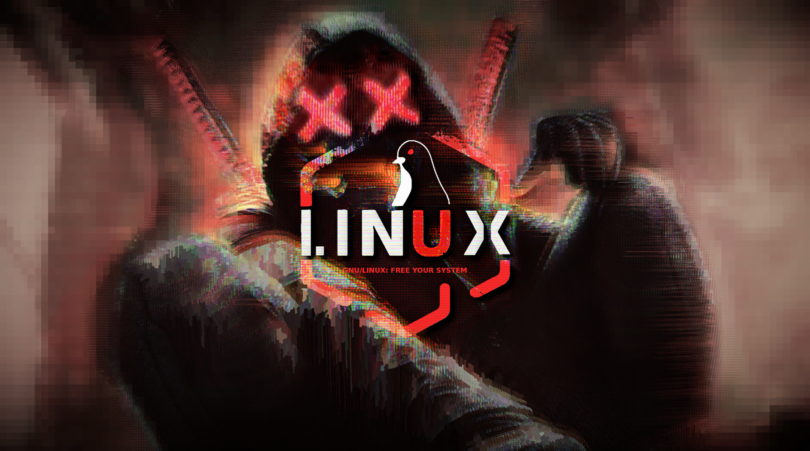

# mbg

Procedurally animate your wallpaper with a hacker/glitch effect, featuring random hue shifts and chromatic aberration for a striking boot-up display.

> Note: I just started studies in the field of cyber security and server management and wanted something to flex a little when I bring my fully customized laptop. I already have a custom boot animation and pretty much everything is riced to the bone, but adding this and maybe playing a cool boot-up soundtrack would take the cake. 
(The cake is a lie).
