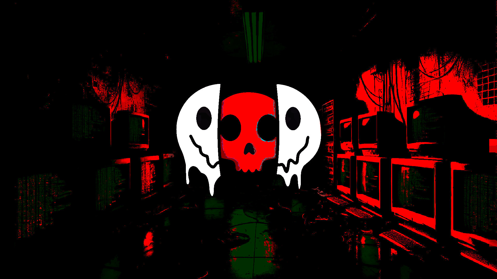

# MBG
> Motion Background Glitch 

Animation example:
~~~ Bash
./mbg.sh -c -s Skull.jpg -u 6 -o 0 -a 60
~~~
Explenation:
"-c" to clear the previous frames, "-s" to specify Skull.jpg as the source, "-u" to set the hue shift, "-o" to set the offset, "-a" to set the Chromatic Aberation.

~~~ Bash
Usage: /home/amos/bin/mbg.sh [options]
Options:
  -s <source>   Path to the source wallpaper image (default: /var/tmp/wallpaper.jpg)
  -d <duration> Duration of the animation in seconds (default: 60) use 0 for infinite
  -f <fps>      Frames per second (default: 24)
  -u <hue>      Maximum hue shift range in degrees (default: 10)
  -a <shift>    Maximum chromatic aberration shift (default: 10)
  -o <offset>   Image position shift (default: 10)
  -c            Clear frames directory (/var/tmp/mbg/)
  -h, --help    Display this help message
~~~

Skull.jpg

Procedurally animate your wallpaper with a hacker/glitch effect, featuring random hue shifts and chromatic aberration for a striking boot-up display.

> Note: I just started studies in the field of cyber security and server management and wanted something to flex a little when I bring my fully customized laptop. I already have a custom boot animation and pretty much everything is riced to the bone, but adding this and maybe playing a cool boot-up soundtrack would take the cake. 
(The cake is a [LIE](https://github.com/AmosNimos/LIE)).
